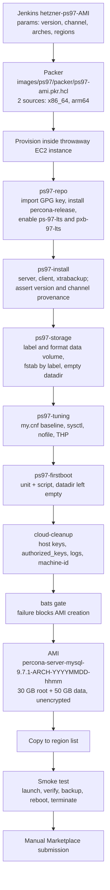
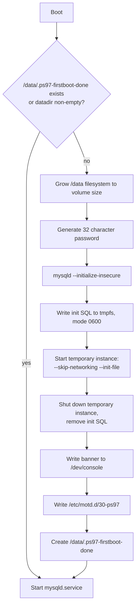

# Percona Server for MySQL 9.7 AMI — Design

**Date:** 2026-09-15
**Status:** Approved, pending implementation
**Scope:** AWS AMI images for Percona Server for MySQL 9.7, published to AWS Marketplace

## Goal

Produce and publish AWS Marketplace AMIs for Percona Server for MySQL 9.7.1 on Amazon
Linux 2023, for x86_64 and arm64, built by a repeatable pipeline with automated bake-time
and boot-time verification.

## Non-goals

- Non-AWS image formats (OVF, Azure, GCP). Roles stay cloud-agnostic so these can be added
  later as new source blocks, but no non-AWS output is produced now.
- Paid or metered Marketplace listings. The listing is free; no product code, entitlement
  check, or metering call is embedded in the image.
- Changes to the DEB/RPM packaging. The image consumes published packages as-is.
- Changes to the existing `packer/mysql80.json`, `packer/pxc80.json`, or the `ansible/`
  trees they use. Those builds keep working unchanged.
- Automated Marketplace submission. Submission is a manual step for this milestone.

## Decisions

| Area | Decision |
|---|---|
| Distribution | AWS Marketplace listing, free (no charge, open source) |
| Base OS | Amazon Linux 2023 |
| Architectures | x86_64 and arm64 |
| Package source | Percona repository, `ps-97-lts` component |
| Server version | 9.7.1 |
| Backup tooling | `percona-xtrabackup-97` from `pxb-97-lts`, release gated on GA |
| Location | `images/ps97/` in this repository |
| Build tool | Packer HCL2 with Ansible roles via `ansible-local` |
| CI | Jenkins, job `hetzner-ps97-AMI` |
| Storage | 30 GB gp3 root plus a 50 GB gp3 data volume, both unencrypted |
| Data directory | `/data/mysql` on the data volume, empty at bake time |
| First-boot auth | Generated per-instance password, surfaced via console and MOTD |
| InnoDB sizing | `innodb_dedicated_server=ON` |
| Host firewall | None; security groups are the boundary |
| Build network | Shared Percona build subnet and security group |
| Testing | Offline unit tests, in-image bats gate, post-launch smoke test |
| Milestone | 2 AMIs built, tested, and copied to the region list |

### Rationale for selected trade-offs

**A separate HCL2 project rather than another `packer/*.json`.** The existing templates are
Packer 1.8.2 JSON with four builders each and a CentOS 7 source AMI. CentOS 7 is EOL and
carries no `ps-97-lts` packages, so nothing in `packer/mysql80.json` is reusable beyond its
shape. Starting from HCL2 also means variable validation, named build blocks, and per-source
selectors, which the Jenkins job needs in order to build one architecture at a time.

**Nothing is initialized at bake time.** `mysqld --initialize` writes a server UUID to
`auto.cnf` and a root credential to the datadir. Baking either would give every instance
launched from the AMI the same identity and the same password. The datadir therefore ships
empty and a bats assertion enforces that before the snapshot.

**`innodb_dedicated_server=ON` rather than a computed buffer pool.** MySQL derives buffer
pool size, redo log capacity, and flush method from detected memory at every start. A value
computed once at first boot would go stale the moment the user changes instance type, and it
would add a code path that has to be tested. One configuration line replaces both.

**A temporary `--skip-networking` instance rather than scraping the error log.** Letting
`mysqld_pre_systemd` auto-initialize and then grepping `/var/log/mysqld.log` for the
temporary password, which is what the Percona Server 8.0 image does, races the service it
is reading from and depends on an unversioned log string. Running a private instance under
the first-boot unit makes the credential deterministic and lets `mysqld.service` start already
secured.

**The filesystem is mounted by label, not device path.** The instance types used here are
Nitro-based, so the `/dev/sdb` requested in the block device mapping appears in the guest as
`/dev/nvme1n1`. The device-enumeration shell in the existing `cloud-node` role assumes stable
`/dev/sd*` names and does not survive this. `LABEL=PS97DATA` in `/etc/fstab` is stable across
instance families and architectures.

**The data volume is deleted on termination.** `packer/mysql80.json` sets
`delete_on_termination: false` on its second volume, which leaves an orphaned EBS volume
behind every time an instance from that AMI is terminated. That behaviour is not carried over.

**No host firewall.** `bind-address = 127.0.0.1` means the server is unreachable off-instance
in the default configuration, so a firewalld rule set adds a second thing to keep in sync
without changing the exposed surface. Security groups are the boundary, matching the Valkey
image.

## Package mapping

| Package | Repository component | Purpose |
|---|---|---|
| `percona-server-server` | `ps-97-lts` | mysqld, systemd units, `mysqld_pre_systemd` |
| `percona-server-client` | `ps-97-lts` | mysql, mysqladmin, mysqldump |
| `percona-xtrabackup-97` | `pxb-97-lts` | xtrabackup, xbstream, xbcloud |
| `percona-toolkit` | `pt` | pt-online-schema-change, pt-table-checksum, and the rest of the toolkit |

`percona-toolkit` **is** available for Amazon Linux 2023, from the `pt` component. The
`tools` component enables cleanly on this distribution but carries no toolkit package,
which is an easy way to conclude wrongly that it is unavailable; the package set from the
Percona Server 8.0 image is carried over in full via `pt`.

At the time of writing `percona-xtrabackup-97` resolves to `9.7.1-1.rc1` in the `release`
channel. The install role fails the build when the resolved XtraBackup version contains `rc`
and `repo_channel` is `release`, so a Marketplace candidate cannot be built against a release
candidate. Builds against `testing` and `experimental` are unaffected.

## Architecture



### First-boot sequence

`ps97-firstboot.service` is ordered `Before=mysqld.service`, `WantedBy=multi-user.target`,
carries `RequiresMountsFor=/data`, and is guarded by
`ConditionPathExists=!/data/.ps97-firstboot-done`.



The marker lives beside the datadir rather than inside it, because `mysqld --initialize`
refuses to run against a non-empty directory. Placing it on the data volume also means a user
who attaches a fresh data volume gets a correctly initialized server with a new credential
rather than a marker on the root volume claiming work that was never done to this disk.

The init SQL file contains the password in plaintext. It is written under `/run`, which is a
tmpfs, with mode `0600`, and removed as soon as the temporary instance exits.

The banner is written to `/dev/console` so it appears in the EC2 system log and is retrievable
without SSH access, and to `/etc/motd.d/30-ps97` so it appears on login.

Rerunning the script is a no-op once the marker exists or the datadir is populated. A password
regenerated on every reboot is the primary failure mode of this design, so the smoke test
reboots the instance and asserts the credential still works.

## Repository layout

```
images/ps97/
  Makefile                                   deps, lint, unit, container, validate, build
  README.md                                  how to build and test
  packer/
    ps97-ami.pkr.hcl                         2 sources, 1 build block, provisioners
    variables.pkr.hcl                        declarations and validation
    release.pkvars.hcl                       version, channel, region list
  ansible/
    ps97-ami.yml                             binds roles in order
    roles/
      ps97-repo/                             GPG key, percona-release, channel enable
      ps97-install/                          packages, version and provenance assertions
      ps97-storage/                          label, format, fstab, empty datadir
      ps97-tuning/                           my.cnf baseline, sysctl, limits, THP
      ps97-firstboot/                        unit and script, baseline lock
      cloud-cleanup/                         identity, secrets, logs; runs last
  scripts/
    cleanup-orphans.sh                       terminate instances left by an interrupted run
  test/
    unit/firstboot.bats                      offline unit tests for the first-boot script
    bats/install.bats                        packages, versions, provenance
    bats/config.bats                         configuration and unit state
    bats/storage.bats                        data volume, fstab, datadir
    bats/hardening.bats                      Marketplace security assertions
    smoke/smoke.sh                           post-launch verification
    container/run.sh                         apply the playbook in an AL2023 container
```

Static files live in the `files/` directory of the role that deploys them. Packer's
`ansible-local` provisioner uploads only `playbook_dir`, so anything outside
`images/ps97/ansible/` would never reach the build instance.

## Components

| Unit | Responsibility | Depends on |
|---|---|---|
| `packer/ps97-ami.pkr.hcl` | Source matrix, AMI naming, tags, region copy | AWS, variables |
| `packer/variables.pkr.hcl` | Variable declarations and validation | — |
| `packer/release.pkvars.hcl` | Version, channel, region list | — |
| `ansible/roles/ps97-repo` | GPG key import, `percona-release`, channel enable | Network |
| `ansible/roles/ps97-install` | Package set, version and provenance assertions | `ps97-repo` |
| `ansible/roles/ps97-storage` | Data volume label, filesystem, mount, SELinux context, empty datadir | `ps97-install` |
| `ansible/roles/ps97-tuning` | `my.cnf` baseline, sysctl, ulimits, THP | `ps97-install` |
| `ansible/roles/ps97-firstboot` | First-boot unit and script | `ps97-storage` |
| `ansible/roles/cloud-cleanup` | Remove identity, secrets, logs before bake | Runs last |
| `test/bats/*.bats` | Bake-time correctness gate | — |
| `test/smoke/smoke.sh` | Boot-time behaviour gate | Published AMI |
| `ps/jenkins/ps97-ami.groovy` | Matrix, credentials, region copy, smoke stage | All |

The pipeline is the one component outside this repository: it lives on the `hetzner` branch
of `Percona-Lab/jenkins-pipelines` and is named `hetzner-ps97-AMI`, matching the branch and
naming of the other image jobs defined there.

Each role has a single responsibility and can be exercised independently. No role depends on
AWS metadata services. The console write is the only AWS-adjacent behaviour and degrades
harmlessly on platforms without a console device.

## Repository configuration

The `ps97-repo` role imports the Percona packaging key by fingerprint, downloads
`percona-release-latest.noarch.rpm`, verifies its signature with `rpmkeys --checksig` before
installing it, then runs `percona-release disable all` followed by
`percona-release enable ps-97-lts <channel>` and `percona-release enable pxb-97-lts <channel>`.

`ps97-install` asserts three things and fails the build otherwise:

1. The installed `percona-server-server` version equals the requested version.
2. The resolved package came from the `ps-97-lts` repository at the requested channel, not
   from the distribution's own MySQL packages.
3. When the channel is `release`, no installed Percona package version contains `rc`.

A channel that has not yet been promoted therefore fails fast with the resolved version
reported, rather than silently producing an AMI labelled with a version it does not contain.

## Baseline configuration baked into the image

| Setting | Value | Reason |
|---|---|---|
| `datadir` | `/data/mysql` | Data on its own volume, separate lifecycle from the OS |
| `bind-address` | `127.0.0.1` | Nothing reachable until the user opts in |
| `skip-name-resolve` | `ON` | Removes a DNS dependency from the connection path |
| `innodb_dedicated_server` | `ON` | Sizes buffer pool and redo log from detected memory |
| `log-error` | `/var/log/mysqld.log` | Package default, kept explicit |
| `mysqld.service` | Enabled | Starts on boot, after first-boot initialization |
| `ps97-firstboot.service` | Enabled | Ordered `Before=mysqld.service` |
| `vm.swappiness` | `1` | Keeps the buffer pool resident |
| Transparent huge pages | Disabled via unit | Removes allocation latency spikes |
| SELinux context | `mysqld_db_t` on `/data/mysql` | Datadir moved off the packaged default path |
| `LimitNOFILE` | `65535` | Raises the unit default |

Configuration is written to `/etc/my.cnf.d/99-percona-ami.cnf`, which sorts last and wins,
rather than editing the packaged `/etc/my.cnf`. A package upgrade therefore cannot silently
revert the baseline.

## Security and Marketplace requirements

The image must satisfy all of the following, each covered by a bats assertion:

- Datadir empty; no `auto.cnf`, no baked server UUID, no baked root credential
- No `/root/.my.cnf` or any other stored credential
- No password set for any OS account, and root login over SSH disabled
- No `authorized_keys` present for any account
- No SSH host keys in the image; regenerated on first boot
- No build artifacts, package caches, or provisioning logs left behind
- `machine-id` cleared, shell history removed, cloud-init state reset
- Root and data volumes unencrypted, as required for Marketplace AMI listings
- MySQL not reachable from outside the instance in the default configuration

## Testing

### Offline unit tests

Run by `make unit` on any workstation; no root, no MySQL, no AWS. Every path the first-boot
script touches is overridable by environment variable, so the suite runs against a temporary
directory.

- Password is 32 characters and alphanumeric
- A second clean run produces a different password
- Re-running with the marker present changes nothing
- Re-running with a populated datadir changes nothing, even without the marker
- The generated init SQL contains a single `ALTER USER` for `root@localhost`
- The init SQL is created mode `0600` and removed after use
- The banner contains the password and the connect instruction
- The MOTD file is written mode `0644`

### In-image bats

Runs inside the build instance before the snapshot. Failure blocks AMI creation.

**install.bats**
- `percona-server-server`, `percona-server-client`, `percona-xtrabackup-97` installed
- Installed server version matches the requested version
- Packages resolved from `ps-97-lts` / `pxb-97-lts` at the requested channel
- No installed Percona package is a release candidate when the channel is `release`
- `mysql` user and group exist
- `mysqld.service` present and enabled; `ps97-firstboot.service` present and enabled

**config.bats**
- `datadir` is `/data/mysql` and `bind-address` is `127.0.0.1`
- `innodb_dedicated_server` is `ON`
- Baseline lives in `/etc/my.cnf.d/99-percona-ami.cnf`, not in `/etc/my.cnf`
- Tuning files present with expected values; `LimitNOFILE` drop-in applied
- First-boot marker absent

**storage.bats**
- `/etc/fstab` mounts `/data` by `LABEL=PS97DATA`, with `nofail`
- `/data` is mounted and is XFS
- `/data/mysql` exists, is owned `mysql:mysql`, mode `0750`, and is **empty**
- SELinux file context for `/data/mysql` resolves to `mysqld_db_t`

**hardening.bats**
- No `authorized_keys` for any account
- `PermitRootLogin no`
- No SSH host keys present
- No OS account has a usable password
- No `/root/.my.cnf`
- No package cache, build artifacts, or provisioning logs remain

### Post-launch smoke

Runs against a launched instance of the finished AMI. Failure marks the build failed and
leaves the AMI unpublished.

- Instance reaches running state and the console log contains the credential banner
- The password from the banner authenticates `root@localhost`
- `CREATE DATABASE` / `CREATE TABLE` / `INSERT` / `SELECT` round-trip succeeds
- `datadir` reports `/data/mysql` and the mount is the data volume
- `auto.cnf` exists and was generated on this instance
- `innodb_buffer_pool_size` exceeds the 128 MB built-in default, confirming
  `innodb_dedicated_server` took effect
- Port 3306 is not reachable from outside the instance
- `xtrabackup --backup` followed by `xtrabackup --prepare` completes successfully
- After a reboot, the password is unchanged, `mysqld` is running, and the marker is present

## Failure handling

| Failure | Behaviour |
|---|---|
| Provisioning error | Packer fails, instance terminated, no AMI, build red |
| Version or provenance assertion | Hard fail in `ps97-install` with the resolved version reported |
| Release candidate on the `release` channel | Hard fail in `ps97-install`; build against `testing` instead |
| bats failure | Hard gate before snapshot; no AMI created |
| Smoke failure | AMI exists but is not published; build marked failed |
| Region copy interruption | Copy is idempotent and safely re-runnable |
| Agent lost mid-build | Orphan sweep at the start of the next build terminates what was left |

## Naming and versioning

AMI name: `percona-server-mysql-<version>-<arch>-<YYYYMMDD-hhmm>`

Example: `percona-server-mysql-9.7.1-arm64-20260915-1430`

The time is part of the name because AWS rejects a duplicate AMI name, so a second build of
the same version on the same day would otherwise fail. This matches the convention used by
the other Percona image builds.

Architecture, server version, XtraBackup version, channel, and build date are also applied as
AMI tags so images can be filtered without parsing names.

## Build network configuration

Build subnet and security group are defaults on the variable declarations in
`packer/variables.pkr.hcl`, the same values the existing Percona AMI builds use. Override with
`-var` or `-var-file` to build in another account. Keeping them on the declarations rather
than in an auto-loaded vars file matches what the Valkey build settled on after auto-loading
proved unreliable across Packer versions.

## Milestones

| ID | Deliverable |
|---|---|
| M0 | `images/ps97/` scaffolding: tree, variables, Makefile, first-boot script and unit tests |
| M1 | x86_64 end to end, built locally: bake, bats, launch, smoke |
| M2 | arm64 added; both images built; region copy |
| M3 | Jenkins job `hetzner-ps97-AMI` with matrix, credentials, region copy, smoke stage |
| M4 | Marketplace preparation: scan checklist, usage instructions, listing content |

M1 deliberately precedes M2. Proving the full path on one image avoids debugging two
simultaneously.

## Assumptions

- Percona Server for MySQL 9.7.1 packages are available in the `release` channel of the
  `ps-97-lts` component for both x86_64 and aarch64 on Amazon Linux 2023. Verified present at
  the time of writing.
- `percona-xtrabackup-97` reaches GA before Marketplace submission. Until then, Marketplace
  candidates cannot be built on the `release` channel by design.
- A build VPC with outbound internet access exists in the build account, and Jenkins has
  credentials permitting EC2 instance launch, AMI creation, and cross-region copy.
- A Percona AWS Marketplace seller account exists for the manual submission step in M4.
